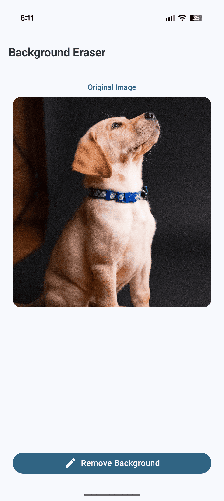
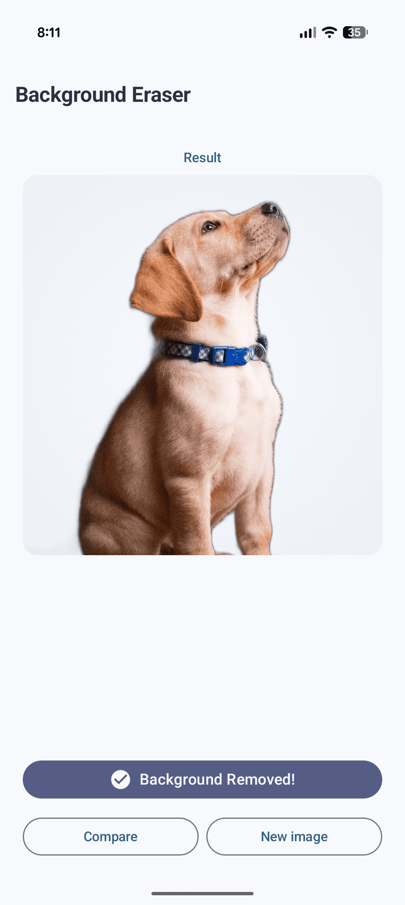
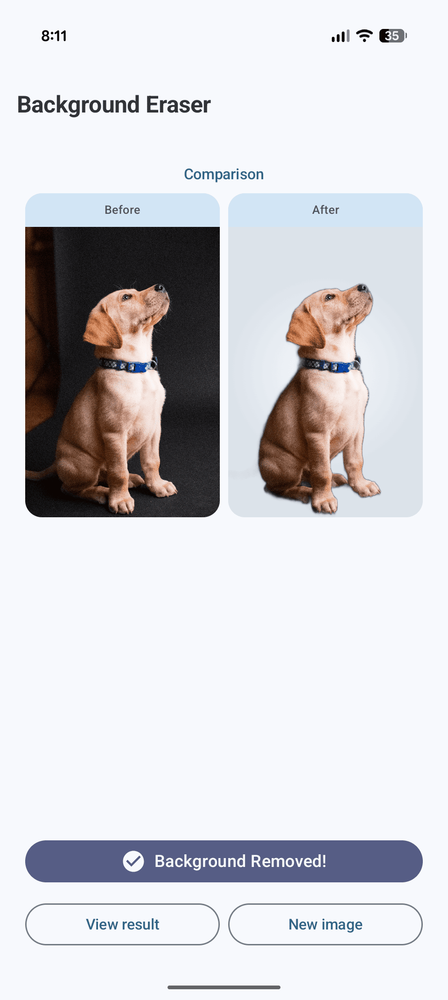

# Background Eraser 🎨

[](https://jitpack.io/#martinlprb23/background-eraser)
[](https://android-arsenal.com/api?level=24)
[](https://opensource.org/licenses/Apache-2.0)

An Android library for removing backgrounds from images using AI-powered segmentation. Built with the U2NetP model and ONNX Runtime for efficient, on-device processing.

<p align="center">
  
  
  
</p>

<p align="center">
  <sub>Original · Background removed · Side by side comparison</sub>
</p>

<br/>

<p align="center">
  
</p>

<p align="center">
  <sub>End-to-end processing demo</sub>
</p>

## ✨ Features

- 🤖 **AI-Powered**: Uses U2NetP deep learning model for accurate segmentation
- 📱 **On-Device Processing**: No internet required, privacy-friendly
- ⚡ **Fast & Efficient**: Optimized with ONNX Runtime
- 🎯 **16KB Compatible**: Fully compatible with Android 15's page size requirements
- 🔧 **Simple API**: Easy-to-use Kotlin interface with Flow support
- 🎨 **Transparent Output**: Returns images with transparent backgrounds

## 📦 Installation

### Step 1: Add JitPack repository

Add it to your `settings.gradle.kts`:

```kotlin
dependencyResolutionManagement {
    repositoriesMode.set(RepositoriesMode.FAIL_ON_PROJECT_REPOS)
    repositories {
        google()
        mavenCentral()
        maven { url = uri("https://jitpack.io") }
    }
}
```

Or if using older project structure, add to root `build.gradle`:

```gradle
allprojects {
    repositories {
        google()
        mavenCentral()
        maven { url 'https://jitpack.io' }
    }
}
```

### Step 2: Add the dependency

In your app's `build.gradle.kts`:

```kotlin
dependencies {
    implementation("com.martinlprb23:bgeraser:1.0.0")
}
```

## 🚀 Quick Start

### Basic Usage

```kotlin
import com.roblescode.bgeraser.BackgroundEraser

class MainActivity : AppCompatActivity() {
    
    private lateinit var eraser: BackgroundEraser
    
    override fun onCreate(savedInstanceState: Bundle?) {
        super.onCreate(savedInstanceState)
        
        // Initialize
        eraser = BackgroundEraser(this)
        
        // Remove background
        lifecycleScope.launch {
            val bitmap = getBitmapFromSomewhere()
            
            eraser.clearBackground(bitmap)
                .onSuccess { resultBitmap ->
                    // Display the image with transparent background
                    imageView.setImageBitmap(resultBitmap)
                }
                .onFailure { error ->
                    // Handle error
                    Log.e("Eraser", "Failed: ${error.message}")
                }
        }
    }
    
    override fun onDestroy() {
        super.onDestroy()
        // Clean up resources
        eraser.close()
    }
}
```

### With Jetpack Compose

```kotlin
@Composable
fun ImageScreen() {
    val context = LocalContext.current
    val scope = rememberCoroutineScope()
    
    var resultBitmap by remember { mutableStateOf<Bitmap?>(null) }
    val eraser = remember { BackgroundEraser(context) }
    
    DisposableEffect(Unit) {
        onDispose { eraser.close() }
    }
    
    Button(
        onClick = {
            scope.launch {
                eraser.clearBackground(originalBitmap)
                    .onSuccess { result ->
                        resultBitmap = result
                    }
            }
        }
    ) {
        Text("Remove Background")
    }
    
    resultBitmap?.let { bitmap ->
        Image(
            bitmap = bitmap.asImageBitmap(),
            contentDescription = "Result"
        )
    }
}
```

### Advanced Usage

```kotlin
// Process with custom error handling
lifecycleScope.launch {
    val originalBitmap = loadImage()
    
    // Optionally resize large images for better performance
    val resizedBitmap = if (originalBitmap.width > 2048) {
        Bitmap.createScaledBitmap(
            originalBitmap, 
            2048, 
            (originalBitmap.height * 2048) / originalBitmap.width, 
            true
        )
    } else {
        originalBitmap
    }
    
    eraser.clearBackground(resizedBitmap)
        .onSuccess { result ->
            // Save to gallery, share, or display
            saveToGallery(result)
        }
        .onFailure { error ->
            when (error) {
                is OutOfMemoryError -> showMemoryError()
                else -> showGenericError(error.message)
            }
        }
}
```


## 🔧 Configuration

### ProGuard

If you're using ProGuard/R8, add these rules (usually not needed as they're included):

```proguard
-keep class ai.onnxruntime.** { *; }
```

### Tips for Better Performance

1. **Resize large images**: Images larger than 2048px should be downscaled
2. **Process off main thread**: Always use coroutines or background threads
3. **Reuse instance**: Create one `BackgroundEraser` instance and reuse it
4. **Close when done**: Call `close()` to free memory

## 🎯 Requirements

- **Minimum SDK**: 24 (Android 7.0)
- **Target SDK**: 36 (Android 16)
- **Kotlin**: 1.9+
- **Coroutines**: Required
- **AndroidX**: Required

## 📱 Compatibility

- ✅ Android 7.0 - 15
- ✅ 16KB page size (Android 15+)
- ✅ All architectures (arm64-v8a, armeabi-v7a, x86, x86_64)
- ✅ Dark mode compatible
- ✅ Compose & XML layouts

## 🔬 Technical Details

- **Model**: U2NetP (4.7MB)
- **Framework**: ONNX Runtime 1.17.1
- **Input**: 320x320 RGB (auto-scaled)
- **Output**: ARGB_8888 with alpha channel
- **Processing**: On-device, no network required

## 📝 Sample App

Check out the [sample app](app/) for a complete example with:
- Image picker integration
- Before/After comparison
- Material 3 UI
- Error handling

## 🤝 Contributing

Contributions are welcome! Please feel free to submit a Pull Request.

1. Fork the repository
2. Create your feature branch (`git checkout -b feature/AmazingFeature`)
3. Commit your changes (`git commit -m 'Add some AmazingFeature'`)
4. Push to the branch (`git push origin feature/AmazingFeature`)
5. Open a Pull Request

## 📄 License

```
Copyright 2026 Martin Robles

Licensed under the Apache License, Version 2.0 (the "License");
you may not use this file except in compliance with the License.
You may obtain a copy of the License at

    http://www.apache.org/licenses/LICENSE-2.0

Unless required by applicable law or agreed to in writing, software
distributed under the License is distributed on an "AS IS" BASIS,
WITHOUT WARRANTIES OR CONDITIONS OF ANY KIND, either express or implied.
See the License for the specific language governing permissions and
limitations under the License.
```

## 🙏 Acknowledgments

- [U2-Net](https://github.com/xuebinqin/U-2-Net) by Xuebin Qin et al. for the amazing model
- [ONNX Runtime](https://onnxruntime.ai/) by Microsoft for the efficient runtime
- All contributors and users of this library

## 📧 Contact

- GitHub: [@martinlprb23](https://github.com/martinlprb23)
- Email: robles.lprb@gmail.com

---

<p align="center">Made with ❤️ by Robles Code</p>
<p align="center">
  <a href="https://github.com/martinlprb23/bgeraser/stargazers">⭐ Star this repo if you find it useful!</a>
</p>
